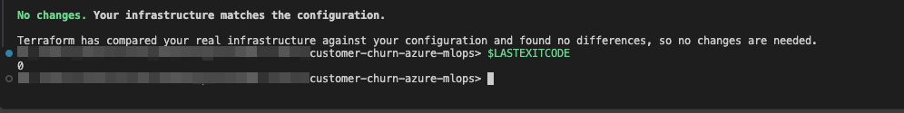
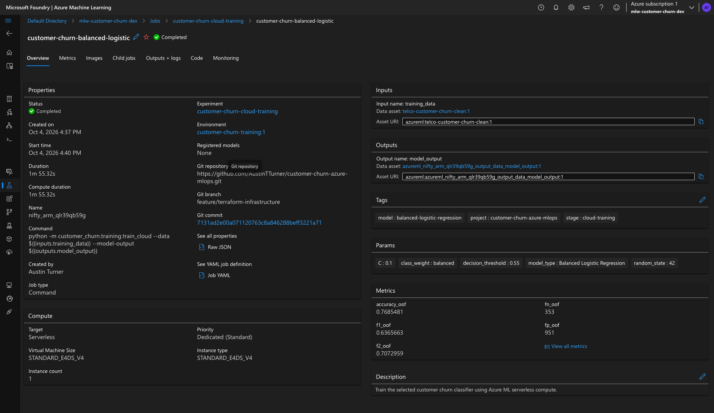
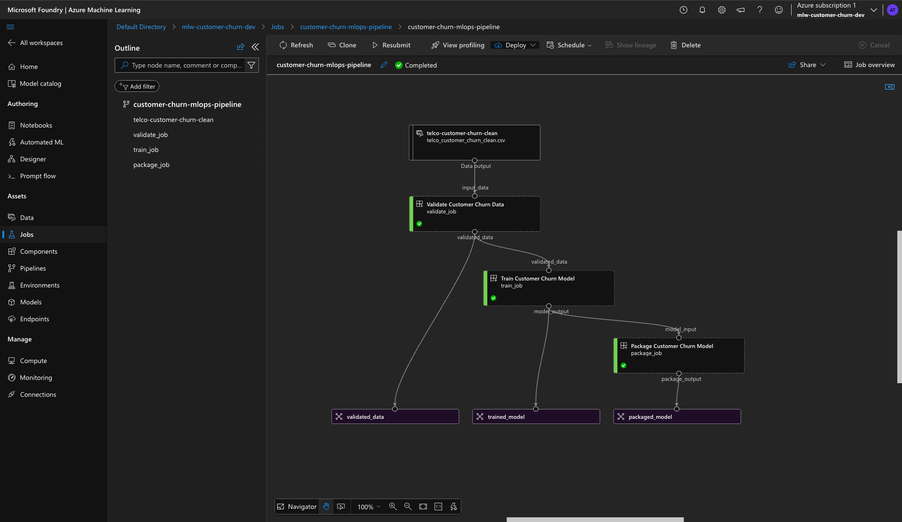
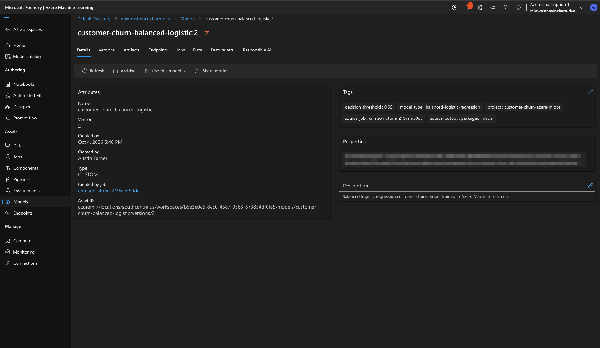
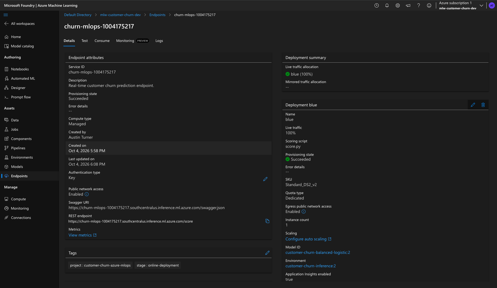
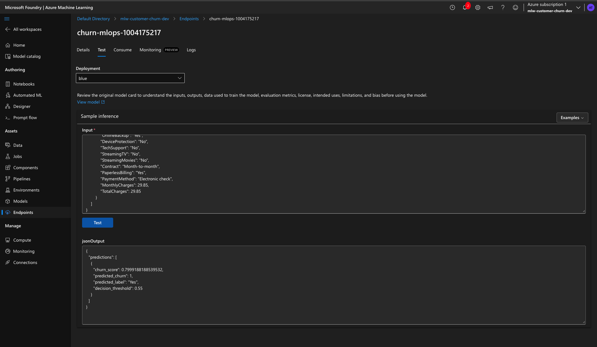
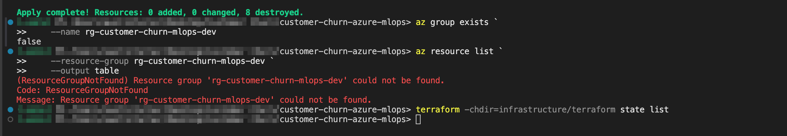

# Customer Churn Prediction with Azure Machine Learning & MLOps

An end-to-end machine learning and MLOps project for predicting telecommunications customer churn using Python, scikit-learn, MLflow, Azure Machine Learning, and Terraform.

The project covers data validation, preprocessing, model comparison, hyperparameter tuning, decision-threshold optimization, model packaging, automated testing, cloud training, Azure ML pipelines, versioned model registration, managed online inference, and Infrastructure as Code.

Terraform provisions the foundational Azure infrastructure, while the Azure Machine Learning SDK manages the machine learning lifecycle. A shared project configuration keeps both layers aligned without hardcoding subscription-specific values into source control.

---

## Business Problem

Customer churn directly affects recurring revenue for subscription-based businesses. Identifying customers who are more likely to leave can help retention teams prioritize outreach before those customers cancel their service.

The objective of this project was not simply to maximize classification accuracy. Because failing to identify a customer who is likely to churn may be more costly than investigating an additional false positive, the modeling workflow placed additional emphasis on recall while still considering precision, F1 score, F2 score, ROC-AUC, and model interpretability.

---

## Solution Overview

The project implements a complete workflow from raw customer data through cloud deployment and real-time inference.

```text
IBM Telco Customer Churn Dataset
                │
                ▼
        Data Validation
                │
                ▼
       Data Preprocessing
                │
                ▼
        Model Comparison
                │
                ▼
     Hyperparameter Tuning
                │
                ▼
   Decision Threshold Optimization
                │
                ▼
        Model Packaging
                │
                ▼
       Azure ML Training
                │
                ▼
       Azure ML Pipeline
                │
                ▼
       Model Registration
                │
                ▼
    Managed Online Endpoint
                │
                ▼
       Real-Time Inference
```

The cloud architecture separates infrastructure provisioning from the machine learning lifecycle:

```text
                    configs/azure.json
                           │
              ┌────────────┴────────────┐
              │                         │
              ▼                         ▼
          Terraform                Azure ML SDK
              │                         │
              │                         ├── Data assets
              │                         ├── Environments
              │                         ├── Training jobs
              │                         ├── Pipelines
              │                         ├── Models
              │                         └── Online endpoints
              │
              ├── Resource Group
              ├── Storage Account
              ├── Key Vault
              ├── Log Analytics
              ├── Application Insights
              ├── Container Registry
              └── Azure ML Workspace
```

This separation keeps foundational cloud infrastructure under Terraform while allowing Azure ML-specific assets and workloads to be managed through the Azure Machine Learning SDK and Azure CLI.

---

## Dataset

The project uses the IBM Telco Customer Churn dataset retrieved through OpenML.

The dataset contains **7,043 customer records** and includes information such as:

- Customer demographics
- Account tenure
- Internet and phone services
- Contract type
- Payment method
- Monthly charges
- Total charges
- Churn status

The `customerID` field is retained for traceability but excluded from model features.

The target variable is converted to a binary representation:

```text
No  = 0
Yes = 1
```

The observed churn rate in the dataset is approximately **26.54%**.

---

## Data Validation and Preparation

The data pipeline performs validation and cleaning before model training.

Important preprocessing steps include:

- Schema validation
- Required-column checks
- Target validation
- Conversion of `TotalCharges` to a numerical value
- Handling of customers with zero tenure
- Separation of numerical and categorical features
- One-hot encoding of categorical features
- Numerical preprocessing
- Exclusion of `customerID` from model features
- Stratified dataset splitting

The numerical feature set includes:

```text
SeniorCitizen
tenure
MonthlyCharges
TotalCharges
```

The remaining modeling variables are treated as categorical features.

The preprocessing logic is implemented with reusable scikit-learn pipelines so that the same transformations used during training are preserved during inference.

---

## Model Comparison

Four classification approaches were evaluated during the initial model comparison.

| Model | Accuracy | Precision | Recall | F1 | ROC-AUC |
|---|---:|---:|---:|---:|---:|
| Logistic Regression | 80.55% | 65.72% | 55.88% | 60.40% | 0.8421 |
| Balanced Logistic Regression | 73.81% | 50.43% | 78.34% | 61.36% | 0.8416 |
| Random Forest | 76.93% | 55.74% | 63.64% | 59.43% | 0.8218 |
| Gradient Boosting | 80.27% | 66.55% | 51.60% | 58.13% | 0.8433 |

The comparison demonstrates why accuracy alone was not used to select the deployment candidate.

Standard logistic regression and gradient boosting achieved higher overall accuracy, but balanced logistic regression provided substantially higher recall for the churn class.

Because the business objective prioritizes identifying customers at risk of leaving, balanced logistic regression became the primary deployment candidate.

---

## Hyperparameter Tuning

Hyperparameter tuning was performed using training-only cross-validation.

For balanced logistic regression, the selected regularization parameter was:

```text
C = 0.1
class_weight = balanced
```

The mean cross-validation F1 score for the selected configuration was approximately:

```text
0.6295
```

Gradient boosting was also tuned for comparison, but balanced logistic regression remained the preferred deployment candidate because of its combination of recall, F1 performance, interpretability, and operational simplicity.

The selected model should therefore be understood as the model chosen for the project's operating objective rather than as a statistically proven universally superior model.

---

## Decision Threshold Optimization

The default classification threshold of `0.50` was not automatically accepted.

Instead, the decision threshold was evaluated using out-of-fold predictions generated from the training data.

The operating objective was to maintain churn recall of at least **75%** while preserving reasonable precision and overall classification performance.

The selected threshold was:

```text
0.55
```

At this threshold, the balanced logistic regression model produced the following development estimates:

| Metric | Development Estimate |
|---|---:|
| Accuracy | **76.85%** |
| Precision | **54.56%** |
| Recall | **76.39%** |
| F1 | **63.66%** |
| F2 | **70.73%** |
| ROC-AUC | **0.8449** |

The corresponding out-of-fold confusion matrix was:

```text
True Negatives:  3,188
False Positives:   951
False Negatives:   353
True Positives:  1,142
```

The F2 score is included because it gives additional weight to recall, which aligns with the churn-detection objective.

---

## Evaluation Methodology

An important methodological limitation is documented intentionally.

The original held-out test set was examined during the earlier model-comparison stage. Because information from that evaluation influenced subsequent development decisions, it can no longer be treated as a completely untouched final test set.

Later hyperparameter tuning and threshold optimization were therefore performed using training-only cross-validation and out-of-fold predictions.

As a result, the final metrics reported above should be interpreted as **development estimates**, not as a completely independent final estimate of generalization performance.

A new independent dataset would be required for a final unbiased evaluation.

This limitation is documented rather than hidden because reproducible machine learning work should distinguish clearly between model-development results and truly independent final evaluation.

---

## Model Packaging

The selected model is packaged as a versioned model artifact containing:

```text
model.joblib
manifest.json
```

The package manifest records metadata such as:

- Model version
- Model type
- Decision threshold
- Expected feature configuration
- Library versions
- Model file hash
- Known evaluation limitations

A copy of the package metadata is tracked in:

```text
reports/model_package_manifest.json
```

Generated model binaries are intentionally excluded from Git.

The inference layer validates package metadata before loading the model, including verification of the packaged model file hash and expected library information.

---

## Inference Behavior

The inference layer returns a churn score, binary prediction, human-readable label, and the decision threshold used for classification.

Example response:

```json
{
  "predictions": [
    {
      "churn_score": 0.7999188188539532,
      "predicted_churn": 1,
      "predicted_label": "Yes",
      "decision_threshold": 0.55
    }
  ]
}
```

### Churn Score vs. Probability

`churn_score` is intentionally not described as a calibrated probability.

The deployment model uses a class-weighted logistic regression configuration and was not subsequently probability-calibrated.

The score is therefore used as the model output evaluated against the configured `0.55` decision threshold rather than being presented as a calibrated estimate of real-world churn probability.

---

## Infrastructure as Code

Terraform is used to provision the foundational Azure infrastructure required by the project.

Terraform manages:

- Azure Resource Group
- Azure Storage Account
- Azure Key Vault
- Azure Log Analytics Workspace
- Azure Application Insights
- Azure Container Registry
- Azure Machine Learning Workspace

Project-level Azure settings are read from:

```text
configs/azure.json
```

The same configuration is also consumed by the Python Azure ML orchestration layer.

This avoids duplicating resource names and environment settings across Terraform and Python.

Terraform-specific documentation is available in:

```text
infrastructure/terraform/README.md
```

### Infrastructure Lifecycle

The infrastructure lifecycle demonstrated by the project was:

```text
Terraform Initialize
        │
        ▼
Terraform Validate
        │
        ▼
Terraform Plan
        │
        ▼
Terraform Apply
        │
        ▼
Azure ML Workload
        │
        ▼
Terraform Drift Check
        │
        ▼
Zero Drift Confirmed
        │
        ▼
Terraform Destroy Plan
        │
        ▼
Terraform Destroy
        │
        ▼
Azure Deletion Verification
```

Terraform successfully reported:

```text
No changes. Your infrastructure matches the configuration.
```

with detailed-exitcode:

```text
0
```



---

## Azure Machine Learning

Azure Machine Learning manages the machine learning lifecycle on top of the Terraform-provisioned infrastructure.

The Azure ML layer includes:

- Versioned data assets
- Training environments
- Inference environments
- Standalone cloud training
- Component-based ML pipelines
- Versioned model registration
- Managed online deployment
- Real-time inference

The Azure subscription ID is intentionally supplied through an environment variable rather than committed to source control.

---

## Cloud Training

The cleaned churn dataset was registered with Azure Machine Learning as a versioned data asset.

The training environment was also registered as a versioned Azure ML environment.

A standalone Azure ML training job successfully executed the balanced logistic regression training workflow in Azure.

The cloud training run used:

```text
Model type:       Balanced Logistic Regression
C:                0.1
Class weighting:  balanced
Threshold:        0.55
Random state:     42
```

The completed Azure ML training run demonstrates that the same project code can execute outside the local development environment.



---

## Azure ML Pipeline

The project implements a three-stage Azure ML pipeline:

```text
Validate Customer Churn Data
              │
              ▼
Train Customer Churn Model
              │
              ▼
Package Customer Churn Model
```

The pipeline produces versionable outputs between components:

```text
validated_data
trained_model
packaged_model
```

This separates validation, training, and packaging into independently defined workflow stages instead of combining the entire process into one cloud script.



---

## Model Registration

Model registration was tested through both standalone training output and pipeline output.

The final pipeline-generated model was registered as:

```text
customer-churn-balanced-logistic:2
```

The registered model retains lineage to the Azure ML pipeline output used to create the model package.

Important model metadata includes:

```text
model_type:          balanced-logistic-regression
decision_threshold:  0.55
source_output:        packaged_model
```



---

## Managed Online Deployment

The registered model was deployed to an Azure Machine Learning managed online endpoint.

The deployment configuration used:

```text
Deployment:      blue
Instance type:   Standard_DS2_v2
Instance count:  1
Traffic:         100%
Model:           customer-churn-balanced-logistic:2
```

`Standard_DS2_v2` was selected as a lightweight, quota-compatible instance for demonstrating the inference workflow. It should not be interpreted as a production sizing recommendation.

The managed endpoint successfully reached a `Succeeded` provisioning state.



---

## Real-Time Inference

A live test request was submitted to the managed Azure ML endpoint.

The endpoint successfully returned:

```json
{
  "predictions": [
    {
      "churn_score": 0.7999188188539532,
      "predicted_churn": 1,
      "predicted_label": "Yes",
      "decision_threshold": 0.55
    }
  ]
}
```

This validated the complete path from:

```text
Client Request
      │
      ▼
Azure ML Endpoint
      │
      ▼
Inference Environment
      │
      ▼
Registered Model
      │
      ▼
Preprocessing + Prediction
      │
      ▼
JSON Response
```



---

## Automated Testing

The project includes automated tests covering the primary data, machine learning, configuration, packaging, and inference workflows.

Final test result:

```text
35 tests collected
35 passed
```

Test coverage includes:

- Data cleaning
- Data validation
- Model preprocessing
- Model comparison
- Model evaluation
- Threshold optimization
- Model training
- Hyperparameter tuning
- Shared Azure configuration
- Model packaging
- Inference behavior

The final test suite was executed successfully with Python 3.12.1.

---

## Continuous Integration

GitHub Actions provides continuous integration for the project through:

```text
.github/workflows/ci.yml
```

The workflow runs automatically on:

- Pull requests targeting `main`
- Pushes to `main`
- Manual workflow dispatch

Two independent CI jobs validate the project.

**Python Tests**

The Python CI job:

1. Checks out the repository
2. Configures Python 3.12
3. Installs the project with development dependencies
4. Runs the complete automated test suite

The current test suite contains:
```
35 tests
35 passed
```

**Terraform Validation**

The Terraform CI job:

1. Checks out the repository
2. Configures Terraform 1.16.4
3. Runs Terraform formatting validation
4. Initializes Terraform without a backend
5. Validates the Terraform configuration

The workflow executes:

```
terraform fmt -check -recursive
terraform init -backend=false -input=false
terraform validate -no-color
```

Both CI jobs were successfully executed through the project's pull request workflow.
```text
Pull Request
      │
      ├──────────────► Python Tests
      │                 35 tests
      │
      └──────────────► Terraform Validation
                        fmt
                        init
                        validate
      │
      ▼
CI Checks Pass
      │
      ▼
Eligible for Merge
```
The CI workflow intentionally does not authenticate to Azure, create infrastructure, deploy models, or incur Azure resource costs.

Continuous Deployment is not currently implemented.

---

## Technology Stack

### Machine Learning

- Python
- scikit-learn
- pandas
- NumPy
- MLflow

### Cloud and MLOps

- Azure Machine Learning
- Azure CLI
- Azure ML SDK
- Managed Online Endpoints

### Infrastructure

- Terraform
- AzureRM Provider
- Azure Resource Manager

### Testing and Development

- pytest
- Git
- GitHub
- GitHub Actions
- VS Code

---

## Repository Structure

```text
customer-churn-azure-mlops/
│
├── .github/
│   └── workflows/
│       └── ci.yml
│
├── azure/
│   ├── components/
│   │   ├── package_model.yml
│   │   ├── train_model.yml
│   │   └── validate_data.yml
│   │
│   ├── endpoints/
│   │   ├── deploy_endpoint.py
│   │   ├── sample_request.json
│   │   └── scoring/
│   │       └── score.py
│   │
│   ├── environments/
│   │   ├── inference_conda.yml
│   │   └── train_conda.yml
│   │
│   ├── jobs/
│   │   ├── submit_pipeline.py
│   │   └── submit_training_job.py
│   │
│   └── sdk/
│       ├── register_data.py
│       ├── register_environment.py
│       ├── register_inference_environment.py
│       ├── register_model.py
│       └── verify_workspace.py
│
├── configs/
│   └── azure.json
│
├── infrastructure/
│   └── terraform/
│       ├── README.md
│       ├── locals.tf
│       ├── main.tf
│       ├── outputs.tf
│       ├── providers.tf
│       ├── terraform.tfvars.example
│       ├── variables.tf
│       └── versions.tf
│
├── notebooks/
│   └── 01_exploratory_data_analysis.ipynb
│
├── reports/
│   ├── figures/
│   ├── baseline_metrics.json
│   ├── model_card.md
│   ├── model_comparison.csv
│   ├── model_package_manifest.json
│   ├── threshold_comparison.csv
│   ├── threshold_summary.json
│   └── tuning_summary.json
│
├── src/
│   └── customer_churn/
│       ├── config.py
│       ├── data/
│       ├── evaluation/
│       ├── features/
│       ├── inference/
│       ├── packaging/
│       ├── pipeline/
│       └── training/
│
├── tests/
│   ├── data/
│   ├── evaluation/
│   ├── features/
│   ├── inference/
│   ├── training/
│   ├── test_config.py
│   └── test_package.py
│
├── docs/
│   └── screenshots/
│       ├── azure-ml/
│       └── terraform/
│
├── pyproject.toml
├── LICENSE
└── README.md
```

Generated data, model binaries, Terraform state, local virtual environments, and other runtime artifacts are intentionally excluded from source control.

---

## Local Setup

The project was developed and tested with Python 3.12.1.

### Clone the Repository

```bash
git clone https://github.com/AustinTTurner/customer-churn-azure-mlops.git
cd customer-churn-azure-mlops
```

### Create a Virtual Environment

```bash
python -m venv .venv
```

PowerShell:

```powershell
./.venv/bin/Activate.ps1
```

### Install the Project

```bash
pip install -e ".[dev]"
```

### Run the Test Suite

```bash
python -m pytest
```

Expected result:

```text
35 passed
```

---

## Azure Setup

Authenticate with Azure:

```powershell
az login
```

The Python Azure ML orchestration scripts read the Azure subscription from an environment variable:

```powershell
$env:AZURE_SUBSCRIPTION_ID = az account show --query id --output tsv
```

Terraform uses the AzureRM provider environment variable:

```powershell
$env:ARM_SUBSCRIPTION_ID = az account show --query id --output tsv
```

Azure resource names, asset names, versions, deployment settings, and project tags are centralized in:

```text
configs/azure.json
```

Terraform setup and infrastructure lifecycle instructions are documented separately in:

```text
infrastructure/terraform/README.md
```

---

## Azure Resource Lifecycle

The cloud infrastructure was intentionally treated as temporary development infrastructure.

After the full Azure ML workflow was demonstrated:

1. The managed online endpoint was deleted.
2. Terraform was run with `-detailed-exitcode`.
3. Terraform reported zero configuration drift with exit code `0`.
4. A destroy plan reported:

```text
Plan: 0 to add, 0 to change, 8 to destroy.
```

5. The reviewed destroy plan was applied.
6. Terraform reported:

```text
Apply complete! Resources: 0 added, 0 changed, 8 destroyed.
```

7. Azure CLI confirmed:

```text
false
```

when checking whether the resource group still existed.

8. A subsequent Azure resource query returned `ResourceGroupNotFound`.
9. `terraform state list` returned no remaining managed resources.

The eight Terraform-managed objects included the foundational Azure resources plus Terraform's random resource-name helper.



This lifecycle demonstrates that the project can provision its cloud environment, execute the ML workflow, verify configuration consistency, and remove the temporary infrastructure when it is no longer needed.

---

## Security and Repository Hygiene

Sensitive and machine-specific runtime artifacts are intentionally excluded from Git.

Examples include:

```text
.venv/
.env
.terraform/
terraform.tfstate
terraform.tfstate.*
*.tfplan
tfplan
tfdestroyplan
generated model binaries
generated data files
```

Azure subscription IDs and credentials are not stored in the committed project configuration.

Terraform state is also excluded because state files may contain sensitive infrastructure metadata.

---

## Limitations

This project has several intentional limitations:

- Final reported model metrics are development estimates rather than results from a completely untouched independent final dataset.
- `churn_score` is not a calibrated probability.
- The dataset is relatively small and historical.
- No continuous production model monitoring or drift detection service is implemented.
- No automated retraining workflow is implemented.
- Terraform currently uses local state.
- Networking is intentionally simplified for a development environment.
- The Azure ML endpoint used a lightweight demonstration instance rather than production sizing.
- Continuous Integration is implemented with GitHub Actions, but Continuous Deployment is not currently implemented.
- The infrastructure is designed as a single development environment rather than separate development, staging, and production environments.

---

## Future Improvements

Potential extensions include:

- Evaluate the final model on a new independent dataset
- Add probability calibration
- Implement model and data drift monitoring
- Add automated retraining
- Use a remote Terraform backend in Azure Storage
- Add Terraform state locking and controlled access
- Implement private networking and private endpoints
- Strengthen Azure identity and access controls
- Extend GitHub Actions with environment-controlled Continuous Deployment and deployment approval workflows
- Add separate development, staging, and production environments
- Expand inference observability and operational monitoring

---

## Project Evidence

The repository includes screenshots demonstrating the completed Azure ML and Terraform workflows.

Azure ML evidence:

```text
docs/screenshots/azure-ml/
```

Terraform evidence:

```text
docs/screenshots/terraform/
```

The screenshots document successful cloud training, pipeline execution, model registration, managed endpoint deployment, real-time inference, Terraform zero-drift verification, and infrastructure teardown.

---

## License

This project is licensed under the terms included in the repository's `LICENSE` file.